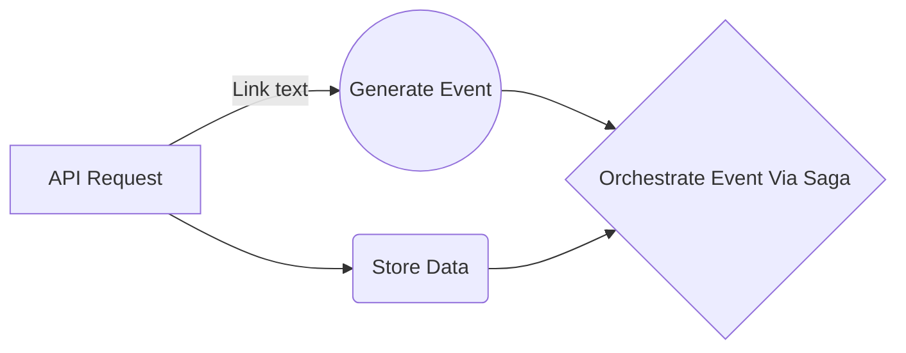

# Todo Application with .NET Core 6 and MassTransit

## Overview

This is a simple Todo Application built with .NET Core 6 and MassTransit, showcasing event-based workflows and sagas for managing tasks.

## Table of Contents

- [Features](#features)
- [Prerequisites](#prerequisites) 
- [Getting Started](#getting-started) 
- [Usage](#usage) 
- [Architecture Overview](#architecture-overview) 


## Features

- Create, Read, Update, and Delete (CRUD) operations for tasks. 
- Event-driven architecture using MassTransit for communication.
-  Sagas for managing complex workflows.

## Prerequisites 
Before you begin, ensure you have met the following requirements: 
- [Install .NET Core 6](https://dotnet.microsoft.com/download/dotnet/6.0) 
- [Install Docker](https://www.docker.com/get-started) (required for RabbitMQ, if not already installed)

## Getting Started
1. Clone the repository:
```
bash git clone https://github.com/your-username/todo-app.git 
cd todoapi
dotnet build 
dotnet run
```
2. The application should now be running. Open your web browser and navigate to `http://localhost:5108` to access the Todo Application.

#### Architecture Overview

The Todo Application is designed with a microservices architecture. It consists of the following components:




-   **Web API**: Exposes CRUD operations for tasks.
-   **Task Service**: Handles task management.
-   **Event Bus (MassTransit)**: Facilitates communication between microservices using publish-subscribe pattern.
-   **Saga**: Manages complex workflows and long-running processes.
-   **Database**: Stores task data.
